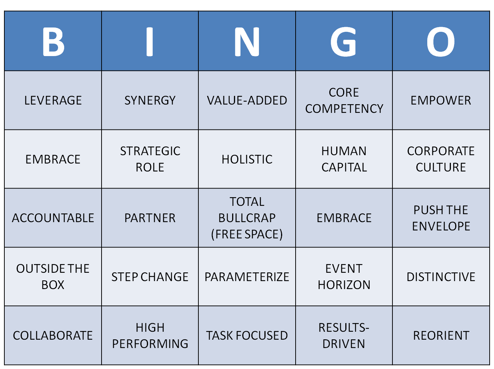

# muppathons
Hackathons for Muppets -- ideas and more

## BS Bingo ….. as a Service (for meetings)

APIs serving data - default in JSON

Responsive Frontend - tailored to optimise for at least iPhone and Desktop

Backend repo for storage:  should be easy to swap out. start simple

Any language impl. possible on server/API side 

Frontend should be using best-practices RWD and RWD framework 

Authentication required - keep it simple to start with…(pre-registration)

Authorization should be easy to add in/on

Grab something from the internet to use as the initial repository of (bs) words...

Lollipops awarded for API design, security, backend setup, UI design, UX, deployment

Extra points and prizes for : 

create multi-player game (join code for game started) - max 5 players per game 

notify all players who won when bingo winner established

Use any resource available to you. Time : 6 HOURS

